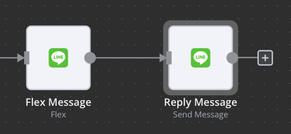

# n8n-nodes-linewebhook

This is an n8n Line support. It lets you create a line chatbot with n8n without any coding.

[n8n](https://n8n.io/) is a [fair-code licensed](https://docs.n8n.io/reference/license/) workflow automation platform.

[Installation](#installation)  
[Operations](#operations)  
[Credentials](#credentials)

## Installation

### Community Nodes (Recommended)

1. Go to Settings > Community Nodes.
2. Select Install.
3. Enter n8n-nodes-linewebhook in Enter npm package name.
4. Agree to the risks of using community nodes: select I understand the risks of installing unverified code from a public source.
5. Select Install.
After installing the node, you can use it like any other node. n8n displays the node in search results in the Nodes panel.


### Manual installation

To get started install the package in your n8n root directory:

```
npm install n8n-nodes-linewebhook
```

For Docker-based deployments, add the following line before the font installation command in your n8n Dockerfile:

RUN cd /usr/local/lib/node_modules/n8n && npm install n8n-nodes-linewebhook

## Operations

### Line Webhook

Supported event types:

- message

  - text
  - audio
  - sticker
  - image
  - video
  - location

- postback
- join
- leave
- member join
- member leave

### Compose Line Message Types

- [Text](https://developers.line.biz/en/docs/messaging-api/message-types/#text-messages)
- [Audio](https://developers.line.biz/en/docs/messaging-api/message-types/#audio-messages)
- [Video](https://developers.line.biz/en/docs/messaging-api/message-types/#video-messages)
- [Image](https://developers.line.biz/en/docs/messaging-api/message-types/#image-messages)
- [Location](https://developers.line.biz/en/docs/messaging-api/message-types/#location-messages)
- [Sticker](https://developers.line.biz/en/docs/messaging-api/message-types/#sticker-messages)
- [Flex](https://developers.line.biz/en/docs/messaging-api/message-types/#flex-messages)

### Line Messaging APIs

#### Send Message

Specify either replyToken to reply message or targetRecipient to send message to a group or a user. You can link the output of the previouse message node to be the content of message property of this node.




### Get Message Content

[API document](https://developers.line.biz/en/reference/messaging-api/#get-group-summary)

When receive multimedia message from webhook, you need to use this node to retrieve the content of the file. For example, if user sends you an image, you can use this node to retrieve the image, and send it to AWS S3.

### Get Group Chat Summary

[API document](https://developers.line.biz/en/reference/messaging-api/#get-group-summary)

Retrieve the group chat summary with a group chat id.

### Get User Profile

[API document](https://developers.line.biz/en/reference/messaging-api/#get-profile)

Retrieve the user's profile with a user id.

## Credentials

### Webhook

1. Sign up on [Line Developer Console](https://developers.line.biz/en/)
2. Create a messaging API channel, and then copy the channel secret
3. Paste the channel secret in node's credential setting
4. Configure the Webhook URL in the messaging API settings


### Messaging API

1. Go to page "Messaging API" setting page in the line developer console.
2. Copy `Channel access token`. Create a new credential in the messaging api node and paste this access token in the "Channel Access Token" property.


